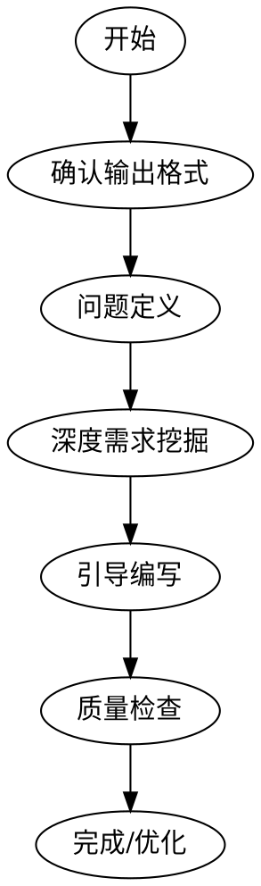

# TRS系统-功能设计文档编写

用于指导编写符合企业级标准的TRS系统功能设计文档。

## 快速开始

当用户需要编写功能设计文档时，直接使用本Skill。

```
用户：帮我写个XXX的功能设计文档

Agent：好的，让我先了解一下需求背景：
1. 这个功能要解决什么问题？
2. 谁会使用这个功能？
...
```

## 文件结构

```
TRS系统-功能设计文档编写/
├── SKILL.md                    # 主文件（加载时读取）
├── CHECKLIST_V2.0.md           # 质量检查清单
├── README.md                   # 本文件
├── CHANGELOG.md                # 更新日志
├── reference/
│   ├── document-structure.md   # 完整章节结构
│   ├── templates.md           # 模板集合
│   ├── tools.md                # 实用工具集
│   ├── examples.md             # 示例库
│   └── traceability-domain.md  # 追溯领域模板（谱系/召回/审计/采集）
└── testing/
    └── pressure-scenarios.md   # 测试场景
```

## 核心流程



### Step 0: 确认输出格式

询问用户选择：
- **Markdown格式**：直接查看、GitHub展示
- **Word友好格式**：最终导出Word

### Step 1: 问题定义

使用5W1H框架：
- Why - 为什么做？
- What - 做什么？
- Who - 谁用？
- When - 什么时候用？
- Where - 在哪里用？
- How - 怎么做？

### Step 2: 深度需求挖掘

- 收集用户画像
- 定义成功指标（SMART原则）
- 挖掘字段、控件、校验细节

### Step 3: 引导编写

按照文档结构逐章引导：
1. 文档控制
2. 问题定义
3. 业务背景
4. 总体设计
5. 详细设计
6. 非功能需求
7. 发布计划
8. 协作管理

### Step 4: 质量检查

使用检查清单逐项验证：
- 结构完整性
- 内容准确性
- 细节明确性

## 关键要点

### 值列表5要素

每个有值列表的字段，必须明确：

| 要素 | 询问内容 |
|------|---------|
| 取数来源 | 取哪个表/快码？ |
| 级联关系 | 选A后B取什么？ |
| 默认规则 | 单值是否默认带出？ |
| 展示要求 | 显示名称还是值？ |
| 支持搜索 | 需要模糊搜索？ |

### 校验规则3要素

| 要素 | 示例 |
|------|------|
| 时机 | 保存时/实时/关闭时 |
| 条件 | XX字段不允许为空 |
| 报错 | "[XX]不能为空" |

### 铁律

```
未经验证的文档声称完整 = 作弊，不是效率
```

## 常用命令

### 开始新文档

```
用户：我要写一个XXX功能的设计文档

Agent：好的，我们开始。
1. 先确认输出格式（Markdown还是Word？）
2. 然后进行问题定义
...
```

### 检查现有文档

```
用户：帮我检查一下这个文档

Agent：好的，我按照检查清单逐项验证。
1. 结构检查...
2. 内容检查...
3. 细节检查...
```

## 参考资源

| 资源 | 用途 |
|------|------|
| [document-structure.md](reference/document-structure.md) | 完整章节结构说明 |
| [templates.md](reference/templates.md) | 9种常见功能模板（含追溯谱系/召回） |
| [tools.md](reference/tools.md) | 10个实用工具 |
| [examples.md](reference/examples.md) | 完整示例 |
| [traceability-domain.md](reference/traceability-domain.md) | 追溯领域模板（谱系/召回/审计/采集） |
| [CHECKLIST_V2.0.md](CHECKLIST_V2.0.md) | 质量检查清单 |
| [pressure-scenarios.md](testing/pressure-scenarios.md) | 测试场景 |

## 版本信息

| 属性 | 值 |
|------|-----|
| 版本 | 3.2 |
| 重构日期 | 2026-03-30 |
| 基于 | 企业顾问团队标准 + GitHub热门PRD模板 + 某客户优秀实践（客户A） |

## 更新日志

详见 [CHANGELOG.md](CHANGELOG.md)

---

**有任何问题？请参考：**
- SKILL.md - 主文件
- reference/examples.md - 完整示例
- testing/pressure-scenarios.md - 常见问题解答
