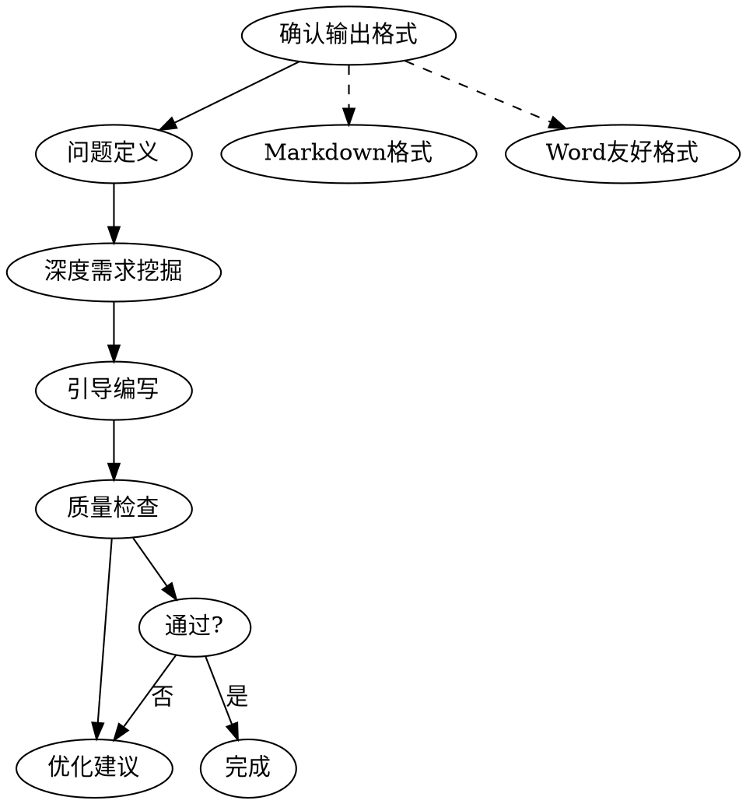

# TRS系统-功能设计文档编写

## Overview

本Skill指导用户编写符合企业级标准的TRS系统功能设计文档。基于企业顾问团队标准，融合GitHub热门PRD模板最佳实践。

**核心原则：** 证据优于断言，验证先于结论。

## Output Contract（输出约定）

最终交付的文档至少满足下面“最小可用规格”（信息不足允许先以假设补齐，但必须显式标注“假设/待确认”）：

- **范围**：In Scope / Out of Scope / Non-goals
- **用户与价值**：用户画像、使用场景、成功指标（SMART + 基线值 + 目标值 + 衡量方法 + 时间周期）
- **业务与流程**：现状流程、目标流程（含异常流程/回退/补偿）
- **功能拆分**：功能列表、用户故事、每个故事的验收标准（Given/When/Then 或清单式）
- **详细设计**：页面/接口/数据项（字段、控件、必填、值列表、级联、默认值、校验、报错）
- **非功能需求**：性能、权限与数据安全、审计与留痕、兼容性、监控与日志
- **风险与依赖**：系统依赖、数据依赖、外设依赖（扫码枪/打印机/采集设备）、关键风险与缓解
- **发布与验收**：试点/灰度、回滚、培训、数据迁移（如有）、验收与复盘

> **红线**：不得用“应该/尽量/支持/优化”等模糊词代替可验证标准；关键声明必须给出验证方法或证据来源。

## When to Use

**使用场景：**
- 用户需要编写新的功能设计文档时
- 用户询问如何写PRD/需求文档时
- 用户需要优化现有功能设计文档时
- 用户询问文档模板或编写规范时
- 用户评估功能价值与风险时

**不适用于：**
- 纯技术实现方案（使用专门的技术设计skill）
- 架构设计文档（使用架构设计skill）

## The Iron Law

```
未经验证的文档声称完整 = 作弊，不是效率
```

**违反这条规则的借口** | **现实**
"我凭经验写就行" | 经验不等于规范，需要逐项确认
"这功能简单，跳过检查" | 越是简单功能越容易忽略关键细节
"时间紧，先写再说" | 返工的时间比预防的时间更长
"差不多就行了" | 开发人员会问你补充细节

## Core Workflow



### Step 0: 确认输出格式

询问用户选择输出格式：

| 格式 | 适用场景 | 特点 |
|------|---------|------|
| **Markdown格式** | 直接查看、GitHub展示 | 标准表格，简洁 |
| **Word友好格式** | 最终导出Word | 避免复杂嵌套 |

### Step 0.5: 先收集“最小输入集”（避免空写）

在进入正文编写前，优先收集下面信息（缺少则记录为“假设 + 待确认问题”，并在相关章节引用）：

- **业务与边界**：业务域/工厂/组织范围、涉及产品/物料范围、追溯粒度（批次/箱/件/序列号）、时间范围
- **主链路**：正向/反向追溯链路、关键节点（采购/入库/生产/检验/包装/出库/客户）
- **数据与编码**：批次/条码/序列号规则、标签打印与贴标规则、扫码采集点位与频率
- **系统集成**：ERP/MES/WMS/QMS/PLM 的主数据与事件数据来源、接口方式（API/文件/消息）、责任方
- **合规与审计**：审计留痕要求、记录保留年限、数据更正机制、权限与职责分离
- **目标与指标**：召回演练时限（例如 X 分钟出具谱系与出货清单）、准确率/覆盖率/时效

### Step 1: 问题定义与价值验证

使用**5W1H框架**深度挖掘：

```
Why (为什么)    → 业务背景、痛点、数据支撑
What (是什么)   → 核心问题、影响范围
Who (谁)        → 提出者、使用者、影响者
When (何时)     → 使用场景、频率、期望上线
Where (在哪里)  → 系统、设备
How (如何)      → 解决方案、替代方案
```

**必问要素：**
- 用户画像（角色、痛点、典型场景）
- 成功指标（符合SMART原则）
- 数据支撑（错误率、处理时间等）

### Step 2: 深度需求挖掘

**核心功能询问：**
- 查询/新增/编辑/删除/导出/上传
- 每个子功能的字段、控件、校验

**字段设计询问框架：**
```
1. 字段名称？
2. 控件类型？（文本、下拉、日期、数值）
3. 必填？
4. 值列表来源？（取表/快码/手工）
5. 级联关系？（选A后B取什么）
6. 校验规则？（格式、长度、重复）
7. 报错信息？（明确字段+修改建议）
```

**TRS系统领域补充（必须覆盖其一或明确“不适用”）：**
- 追溯谱系（Lot Genealogy）：拆分/合并/转产/返工/报废的多对多关系与口径
- 召回与演练（Mock Recall）：影响范围计算、库存/在制/在途/已出货清单、证据包导出
- 质量放行/冻结：检验结论与状态流转、隔离区、解冻审批
- 条码/标签：码制、校验、打印模板、补打/作废、盘点与对账
- 审计留痕：谁在何时因何更改了什么（含前后值）、更正/冲销机制
- 集成与一致性：主数据、事件数据、幂等/重放、延迟与补偿

### 硬约束（Must-Do，任何时候都不能跳过）

**1) 假设表格式必须固定**  
- 关键点无法从用户话语/资料中确认时，输出“假设表”（表头固定、至少1行），并在文档相关章节引用。

**2) 值列表与校验不允许编造**  
- `值列表5要素` 与 `校验3要素`：用户未明确时只能“占位 + 假设 + 风险”，不得用泛化经验代替。

**3) 输出完成度门禁（可交付最小标准）**
- 章节：`1-7章`必须出现；`8章非功能需求`与`9章发布计划与验收`必须出现（简版即可，显式标注“假设/待确认”）
- 复杂度：`10章`或`11章`至少保留其一
- 验收：每个子功能至少 3 条；追溯/召回必须含“可演练、可导出、可审计”
- 报错：禁止“操作失败/请检查输入/数据错误”等模糊报错；必须给字段级报错模板

**4) 范围裁剪决策树（只裁剪展开深度，不裁剪硬字段）**
- A档（小型）：不涉及谱系拆分/合并、召回演练、审计更正/冲销、离线补传、跨多系统 => `8/9简版`，`10/11可不写`
- B档（中型）：涉及上述能力 1-2 项 => `8/9标准版`，`10建议`，`11可选`
- C档（大型）：涉及上述能力 >=2 项或跨多系统 => `8/9标准或更细`，`10/11至少写1个`

### 最小问题集（MVP Questions）

为避免“问得不够但又硬写”，每次提问按下面最小集合执行：

**Step 0.5（最小输入集）— 必问 6 项（允许简短回答）**
追溯粒度（批次/箱/件/序列号，至少1）、关键节点（>=2）、扫码点位与频率（>=1例）、码制/条码规则（允许待确认）、集成系统（或明确“不适用”）、审计留痕/更正机制（需要/不需要/待确认）

**Step 1（问题定义与价值验证）— 必问 3 项**
核心问题（1-2句）、成功指标（>=2条，SMART+基线/目标/方法/周期）、用户画像（>=1角色+典型场景）

**Step 2（深度需求挖掘）— 必问 2 项**
追溯领域补充项（>=1命中/明确不适用）、至少1个关键字段的值列表取数来源规则

### 反失败纠偏脚本（针对用户施压短语）

- `“这功能简单/不用问”`：仍执行 Step 0.5 + 选 1 个关键字段写值列表5要素（允许假设但必须标注风险）
- `“时间紧/先写大概/后面补充”`：只交“最小可交付骨架 + 验收 + 字段级报错占位”，其余写入假设表
- `“8/9不用写/非功能和发布计划先不写”`：仍输出 `8/9` 简版（可验证要求+回滚/退出/成功指标检查），其余写入假设表
- `“跳过质量检查/不需要验收标准”`：必须补齐验收（每子功能>=3）；否则停止要求补齐清单
- `“值列表不用那么详细/不用5要素”`：仍写5要素；用户缺失则假设表标“高风险”
- `“值列表来源别问/你自己编一个”`：不编造；值列表来源用占位写入假设表，并向用户确认“允许按假设继续”
- `“报错别写具体/随便一句”`：必须改成字段级报错模板（字段名+修改建议）
- `“审计留痕不重要/不要考虑更正”`：给出“留痕/更正是否需要”选项；坚持不做则审计章节写“明确不适用原因+风险等级”

### Step 3: 引导编写

按照**文档结构**逐章引导：

| 章节 | 必填/可选 | 关键点 |
|------|----------|--------|
| 1. 文档控制 | 必填 | 版本、审核、状态 |
| 2. 问题定义 | 必填 | 5W1H、用户画像 |
| 3. 业务背景 | 必填 | 四段式结构 |
| 4. 总体设计 | 必填 | 流程图、功能列表 |
| 5. 详细设计 | 必填 | 数据项、校验、交互 |
| 6. 非功能需求 | 建议 | 性能、安全、兼容 |
| 7. 发布计划 | 可选 | 上线、回滚、验收 |
| 8. 协作管理 | 可选 | 决策、变更、问题 |

### Step 4: 质量检查

使用**三段式验证**：

```
1. 结构检查 → 章节完整、编号正确
2. 内容检查 → 字段完整、校验明确
3. 细节检查 → 报错信息、术语一致
```

---

## Quick Reference

### 值列表5要素

| 要素 | 询问问题 |
|------|---------|
| 取数来源 | 取哪个表/快码？ |
| 级联关系 | 选A后B取什么？ |
| 默认规则 | 单值是否默认带出？ |
| 展示要求 | 显示名称还是值？ |
| 支持搜索 | 需要模糊搜索？ |

### 校验规则3要素

| 要素 | 示例 |
|------|------|
| 时机 | 保存时/实时/关闭时 |
| 条件 | XX字段不允许为空 |
| 报错 | "[XX]不能为空，请填写后保存" |

### 报错信息规范

```
✅ 正确： "[文件名称]不能为空，请填写后保存"
❌ 错误： "请填写完整信息"

✅ 正确： "[编码]已存在，请重新命名"
❌ 错误： "数据重复"
```

---

## 文档结构（完整模板）

### 1. 文档控制

```markdown
| 日期 | 作者 | 版本 | 更改参考 |
|------|------|------|----------|
| YYYY-MM-DD | 姓名-工号 | X.Y | 初始版本 |

| 姓名 | 职位 | 签字 |
|------|------|------|
| | | |

> 版本：X.X
> 当前文档状态：**已审核**
```

### 2. 问题定义与用户画像

```markdown
**核心问题：** [1-2句话描述]

**用户画像：**
- 基本信息：年龄、学历、技能水平
- 核心目标：想完成什么任务
- 关键痛点：[具体描述+数据]
- 典型场景：[描述使用场景]
- 成功标准：[什么情况下觉得好用]
```

### 3. 业务背景（四段式结构）

```markdown
> 出于业务需要，用户会将[当前操作方式],存在以下问题：
> 1. [问题描述1，如：查找效率低，平均需要10分钟]
> 2. [问题描述2，如：数据不统一，错误率约20%]
>
> 这些问题导致[后果]。
>
> 业务部门提出需求：通过系统实现[需求内容]。
```

### 4. 总体设计

```markdown
> **[功能总体说明：]**
> [1-2句话概括]

> **[流程说明：]**
> 修改场景：
> 1. [场景描述]
>
> 新增场景：
> 1. [场景描述]

> **[界面流转：]**
> 1. A → B：点击[按钮]后跳转到B界面
```

### 5. 详细设计

**第一级表格 - 区域说明：**
```markdown
| 区域名称 | 新增 | 删除 | 表单自定义 | 头信息 |
|---------|-----|-----|-----------|-------|
| 查询条件 | N | N | N | N |
```

**第二级表格 - 数据项说明：**
```markdown
| 序号 | 字段名 | 控件 | 必输 | 值列表 | 默认值 | 校验规则 |
|------|--------|------|------|--------|--------|---------|
| 1 | | | | | | |
```

**值列表5要素：**
```markdown
**字段：[字段名称]**
- 取数来源：取XX表/快码XX
- 级联关系：选择A后，B取什么
- 默认规则：单值是否默认带出
- 展示要求：显示名称还是值
- 支持搜索：是否需要模糊搜索
```

**补充逻辑：**
```markdown
**1. 数据来源：**
- [字段1]：[说明]
- [字段2]：[说明]

**2. 交互说明：**
| 序号 | 按键 | 作用 |
|------|------|------|
| 1 | 保存 | 点击后保存当前信息 |

**3. 补充逻辑：**
- 验重逻辑：保存时校验XX不允许重复
- 删除逻辑：检查是否被引用，报错"[数据]已被使用"
```

### 6. 非功能性需求

```markdown
| 类型 | 要求 |
|------|------|
| 性能 | 响应时间<2秒，支持100并发 |
| 安全 | 权限控制、审计日志 |
| 兼容 | Chrome/Edge/Firefox最新版本 |
```

### 7. 发布计划

```markdown
| 阶段 | 时间 | 范围 | 目标 | 退出标准 |
|-----|------|-----|------|---------|
| 试点 | 上线后1周 | 部分用户 | 验证稳定性 | 无严重bug |
| 推广 | 上线后1月 | 全部用户 | 全面使用 | 满意度>4分 |
```

---

## 实用工具集

### 工具1: SMART指标检查器

| 原则 | 检查项 |
|------|--------|
| S (Specific) | 具体明确吗？ |
| M (Measurable) | 可以衡量吗？ |
| A (Achievable) | 可以达成吗？ |
| R (Relevant) | 与目标相关吗？ |
| T (Time-bound) | 有时间限制吗？ |

### 工具2: 风险评估矩阵

| 影响\概率 | 高 | 中 | 低 |
|-----------|----|----|----|
| 高 | 🔴高 | 🟠中高 | 🟡中 |
| 中 | 🟠中高 | 🟡中 | 🟢低 |
| 低 | 🟡中 | 🟢低 | 🟢低 |

### 工具3: 利益相关者清单

```markdown
| 角色 | 姓名/部门 | 职责 | 批准状态 |
|-----|----------|------|---------|
| 产品负责人 | XXX | 最终决策 | 待批准 |
| 技术负责人 | XXX | 技术评审 | 已批准 |
```

---

## Anti-Patterns

| 常见错误 | 正确做法 |
|---------|---------|
| 直接开始写 | 先用5W1H深度挖掘 |
| 只写格式校验 | 包含时机+条件+报错 |
| 模糊报错信息 | 明确字段+修改建议 |
| 忽略级联关系 | 明确"选A后B取什么" |
| 忘记成功指标 | 用SMART原则量化 |

---

## 完整示例

### 示例: 文件类型配置功能

```markdown
# 文件类型配置功能设计文档

## 1. 文档控制

| 日期 | 作者 | 版本 | 更改参考 |
|------|------|------|----------|
| 2026-03-22 | 张明-S001 | 1.0 | 初始版本 |

> 版本：1.0
> 当前文档状态：**已审核**

## 4. 问题定义与用户画像

**核心问题：** 供应链文件管理混乱，无法快速查找和追溯历史文件。

**用户画像：质量检验员**
- 核心目标：快速查找检验报告，追溯产品问题来源
- 关键痛点：
  - 手工记录效率低，每天需要2-3小时
  - 查找历史记录困难，平均需要10分钟
- 成功标准：1分钟内找到目标文件，错误率<5%

## 5. 概述

> 出于业务需要，用户会将供应链文件分散存储，存在以下问题：
> 1. 查找效率低：平均需要10分钟才能找到目标文件
> 2. 版本混乱：同一文件存在多个版本
> 3. 关联缺失：文件与业务数据没有关联
>
> 这些问题导致审计效率低、追溯困难。
>
> 业务部门提出需求：通过系统实现文件类型的统一配置和管理。

## 6. 总体设计

> **[功能总体说明：]**
> 本功能用于定义系统中进行管理的文件类型及相关配置。

> **[流程说明：]**
> 修改场景：
> 1. 已有信息发生改变时，在原链路上修改
>
> 新增场景：
> 1. 出现与现有差异较大的配置，新增链路

## 7. 详细设计

### 7.1 数据项设计

**查询条件区：**
| 序号 | 字段名 | 控件 | 必输 | 值列表 | 说明 |
|------|--------|------|------|--------|------|
| 1 | 物料类别 | 下拉框 | N | 快码XX | 支持搜索 |
| 2 | 文件类型名称 | 文本框 | N | 无 | 模糊查询 |

**表单区域：**
| 序号 | 字段名 | 控件 | 必输 | 值列表 | 默认值 | 校验规则 |
|------|--------|------|------|--------|--------|---------|
| 1 | 文件类型编码 | 文本框 | Y | 自动生成 | - | - |
| 2 | 文件类型名称 | 文本框 | Y | 无 | - | 验重 |
| 3 | 物料类别 | 下拉框 | Y | 快码XX | - | - |

**字段：物料类别**
- 取数来源：取快码Item_Categories
- 级联关系：无
- 默认规则：无
- 展示要求：前台展示快码名称
- 支持搜索：支持模糊搜索

### 7.2 补充逻辑

- **删除校验逻辑：** 删除前检查是否被引用，若被引用则报错"当前数据已被使用，不允许删除"
- **编码自动生成：** 保存时自动生成，规则为物料类别代码+3位流水号
- **验重逻辑：** 保存时校验文件类型名称不允许重复，报错"当前文件类型名称已存在"
```

---

## 测试场景

### 场景1: 跳过问题定义

```
用户：帮我写个文件类型配置的功能设计文档。

验证：
1. agent是否先进行问题定义？
2. 是否使用5W1H框架挖掘需求？
3. 还是直接开始写文档？
```

**通过标准：** agent先询问5W1H问题，收集用户画像后再开始编写。

### 场景2: 模糊的报错信息

```
用户：字段校验失败的报错怎么写？

通过标准：
✅ "当前[字段名]已存在，请重新命名"
❌ "操作失败"
```

---

## The Bottom Line

**没有捷径可走。**

深度询问 → 结构化编写 → 逐项检查 → 持续优化

这不是可选的"最佳实践"，这是最低标准。

---

**Skill版本：** 3.2
**重构日期：** 2026年3月30日
**基于：** 企业顾问团队标准 + GitHub热门PRD模板 + 某客户优秀实践（客户A）

---

## 更新日志

### V3.2 - 2026-03-30
- 激进重构：新增硬约束（对话/输出门禁）、最小问题集与反失败纠偏脚本
- 新增范围裁剪决策树（只裁剪展开深度，保证硬字段/门禁不被跳过）

### V3.1 - 2026-03-30
- 增加 Output Contract（输出约定），明确最小可用交付标准与“假设/待确认”机制
- 增加 Step 0.5 最小输入集（追溯粒度、链路、编码、集成、审计、指标），避免信息不足时空写
- 增加追溯领域必覆盖项（谱系/召回演练/审计留痕/外设采集/一致性）

### V3.0 - 2026-03-30
- 全面重构，按照优秀Skill标准
- SKILL.md从2100+行精简至~200行
- 添加YAML Frontmatter
- 新增测试场景和反合理化机制
- 文件拆分实现渐进加载

### V2.1 - 2026-03-30
- 融合某客户优秀实践（客户A）
- 新增文档控制规范化
- 新增业务背景四段式结构
- 新增值列表5要素详细说明

### V2.0 - 2026-03-30
- 融合GitHub热门PRD模板
- 新增问题定义与价值验证
- 新增用户画像、成功指标SMART原则
- 新增风险评估与非功能需求

### V1.0 - 2026-03-22
- 初始版本
