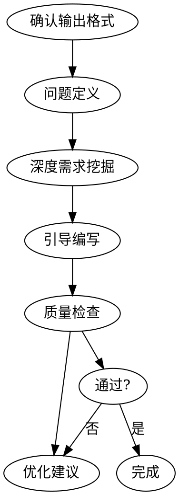
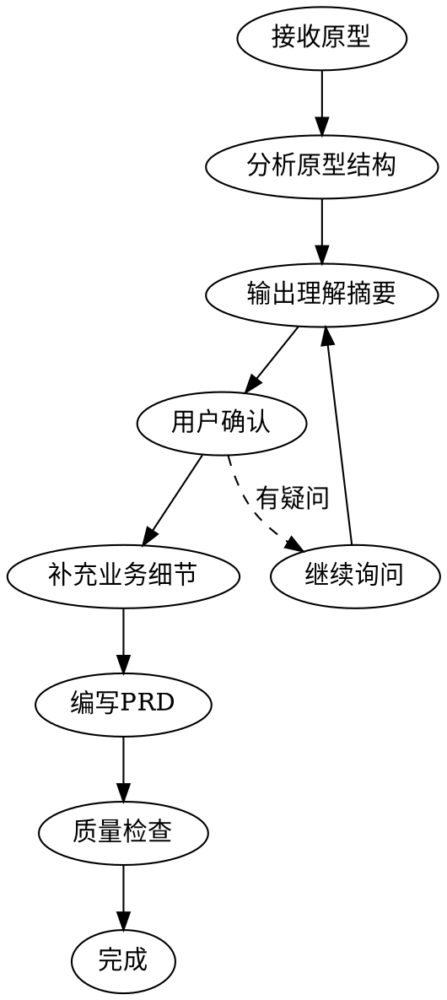

# TRS系统-功能设计文档编写

## Overview

本Skill指导用户编写符合企业级标准的TRS系统功能设计文档。基于企业顾问团队标准，融合GitHub热门PRD模板最佳实践。

**核心原则：** 证据优于断言，验证先于结论。

## Output Contract（输出约定）

最终交付的文档至少满足下面“最小可用规格”（信息不足允许先以假设补齐，但必须显式标注“假设/待确认”）：

- **范围**：In Scope / Out of Scope / Non-goals
- **用户与价值**：用户画像、使用场景、成功指标（SMART + 基线值 + 目标值 + 衡量方法 + 时间周期）
- **业务与流程**：现状流程、目标流程（含异常流程/回退/补偿）
- **功能拆分**：功能列表、用户故事、每个故事的验收标准（Given/When/Then 或清单式）
- **详细设计**：页面/接口/数据项（字段、控件、必填、值列表、级联、默认值、校验、报错）
- **非功能需求**：性能、权限与数据安全、审计与留痕、兼容性、监控与日志
- **风险与依赖**：系统依赖、数据依赖、外设依赖（扫码枪/打印机/采集设备）、关键风险与缓解
- **发布与验收**：试点/灰度、回滚、培训、数据迁移（如有）、验收与复盘

> **红线**：不得用“应该/尽量/支持/优化”等模糊词代替可验证标准；关键声明必须给出验证方法或证据来源。

## When to Use

**使用场景：**

| 场景 | 说明 | 触发关键词 |
|------|------|-----------|
| **传统需求沟通** | 用户口头描述需求，通过5W1H深度挖掘 | "我需要一个XX功能" |
| **原型驱动（推荐）** | 用户提供HTML/图片等原型，先理解原型再写PRD | "给你原型"、"看这个设计" |
| **文档优化** | 优化或重构现有功能设计文档 | "优化文档"、"改版" |
| **模板查询** | 询问文档模板或编写规范 | "模板"、"怎么写" |

**不适用于：**
- 纯技术实现方案（使用专门的技术设计skill）
- 架构设计文档（使用架构设计skill）

## The Iron Law

```
未经验证的文档声称完整 = 作弊，不是效率
```

**违反这条规则的借口** | **现实**
"我凭经验写就行" | 经验不等于规范，需要逐项确认
"这功能简单，跳过检查" | 越是简单功能越容易忽略关键细节
"时间紧，先写再说" | 返工的时间比预防的时间更长
"差不多就行了" | 开发人员会问你补充细节

## Core Workflow

本skill支持两种工作模式：**传统需求沟通** 和 **原型驱动（推荐）**。

### 模式A：传统需求沟通



适用于用户口头描述业务需求，通过5W1H框架深度挖掘。

### 模式B：原型驱动（推荐）⭐

适用于用户提供HTML/图片/Figma等原型设计。



**详细说明** → 见 [reference/prototype-driven.md](reference/prototype-driven.md)

### 如何选择模式

| 条件 | 推荐模式 |
|------|---------|
| 用户提供了原型文件 | **原型驱动** |
| 用户口头描述需求 | 传统需求沟通 |
| 用户说"给你原型先看看" | **原型驱动** |
| 用户问"PRD模板怎么写" | 传统需求沟通 |

### Step 0: 识别工作模式

**首先判断用户属于哪种场景：**

**场景1：用户提供原型**
- 触发：用户提供了HTML/图片/Figma文件，或说"给你原型"
- 动作：**直接进入原型驱动流程**（见下方）

**场景2：用户口头描述需求**
- 触发：用户描述业务需求
- 动作：进入传统需求沟通流程（Step 0.5 → Step 1...）

---

## 快速开始：原型驱动流程

当用户提供原型时，按以下步骤执行：

### 快速流程图

```
接收原型 → 读取分析 → 输出理解摘要 → 用户确认 → 补充细节 → 编写PRD
```

### Step P1: 接收并读取原型

**读取规则：**
- HTML文件：读取完整源码（HTML+CSS+JS）
- 图片文件：描述看到的UI元素、布局、文字
- 标注：字段名、按钮文字、状态值、颜色含义

### Step P2: 分析并输出理解摘要

**必须输出的内容：**

```markdown
## 原型理解摘要

### 页面关系
（列出所有页面的跳转关系）

### 功能清单
（用表格列出识别到的功能点，标注确认状态）

### 不确定项
（原型无法确定的内容，用❓标记）
```

**不理解的内容，必须标注❓，不得跳过**

### Step P3: 向用户确认

**必须询问的问题：**
1. 业务背景：这套系统的业务目的是什么？
2. 功能边界：原型中跳转/按钮的具体行为？
3. 状态逻辑：状态变更后的处理逻辑？
4. 异常处理：边界条件和错误情况？

**询问原则：**
- 优先问"会改变设计"的问题
- 每轮不超过5个问题
- 用开放式问题

### Step P4: 补充业务细节

基于用户回答，补充：
- 成功指标
- 异常处理
- 集成关系
- 审计留痕

### Step P5: 编写PRD文档

按照标准模板编写，**标注来源**：
- 原型已体现 → 标注"见原型"
- 询问补充 → 标注"用户确认"

---

### Step 0: 确认输出格式（仅传统流程）

询问用户选择输出格式：

| 格式 | 适用场景 | 特点 |
|------|---------|------|
| **Markdown格式** | 直接查看、GitHub展示 | 标准表格，简洁 |
| **Word友好格式** | 最终导出Word | 避免复杂嵌套 |

### Step 0.5: 先收集“最小输入集”（避免空写）

在进入正文编写前，优先收集下面信息（缺少则记录为“假设 + 待确认问题”，并在相关章节引用）：

- **业务与边界**：业务域/工厂/组织范围、涉及产品/物料范围、追溯粒度（批次/箱/件/序列号）、时间范围
- **主链路**：正向/反向追溯链路、关键节点（采购/入库/生产/检验/包装/出库/客户）
- **数据与编码**：批次/条码/序列号规则、标签打印与贴标规则、扫码采集点位与频率
- **系统集成**：ERP/MES/WMS/QMS/PLM 的主数据与事件数据来源、接口方式（API/文件/消息）、责任方
- **合规与审计**：审计留痕要求、记录保留年限、数据更正机制、权限与职责分离
- **目标与指标**：召回演练时限（例如 X 分钟出具谱系与出货清单）、准确率/覆盖率/时效

### Step 1: 问题定义与价值验证（V2.0新增）

使用**5W1H框架**深度挖掘：

```
Why (为什么)    → 业务背景、痛点、数据支撑
What (是什么)   → 核心问题、影响范围
Who (谁)        → 提出者、使用者、影响者
When (何时)     → 使用场景、频率、期望上线
Where (在哪里)  → 系统、设备
How (如何)      → 解决方案、替代方案
```

**必问要素：**
- 用户画像（角色、痛点、典型场景）
- 成功指标（符合SMART原则）
- 数据支撑（错误率、处理时间等）

### Step 2: 深度需求挖掘

**核心功能询问：**
- 查询/新增/编辑/删除/导出/上传
- 每个子功能的字段、控件、校验

**TRS系统领域补充（必须覆盖其一或明确“不适用”）：**
- 追溯谱系（Lot Genealogy）：拆分/合并/转产/返工/报废的多对多关系与口径
- 召回与演练（Mock Recall）：影响范围计算、库存/在制/在途/已出货清单、证据包导出
- 质量放行/冻结：检验结论与状态流转、隔离区、解冻审批
- 条码/标签：码制、校验、打印模板、补打/作废、盘点与对账
- 审计留痕：谁在何时因何更改了什么（含前后值）、更正/冲销机制
- 集成与一致性：主数据、事件数据、幂等/重放、延迟与补偿

**字段设计询问框架：**
```
1. 字段名称？
2. 控件类型？（文本、下拉、日期、数值）
3. 必填？
4. 值列表来源？（取表/快码/手工）
5. 级联关系？（选A后B取什么）
6. 校验规则？（格式、长度、重复）
7. 报错信息？（明确字段+修改建议）
```

### Step 3: 引导编写

按照**文档结构**逐章引导：

```
章节 | 必填/可选 | 关键点
-----|----------|--------
1. 文档控制 | 必填 | 版本、审核、状态
2. 问题定义 | 必填 | 5W1H、用户画像
3. 业务背景 | 必填 | 四段式结构
4. 总体设计 | 必填 | 流程图、功能列表
5. 详细设计 | 必填 | 数据项、校验、交互
6. 非功能需求 | 建议 | 性能、安全、兼容
7. 发布计划 | 可选 | 上线、回滚、验收
8. 协作管理 | 可选 | 决策、变更、问题
```

**详细章节结构** → 见 [reference/document-structure.md](reference/document-structure.md)

**交互协议（建议遵循）：**
- **先问再写**：每轮提问不超过 10 个问题，优先问会改变设计分支的问题（范围、粒度、链路、编码、集成、审计）。
- **写的时候也标注不确定性**：将缺失信息集中放入“假设与待确认（Assumptions & Open Questions）”表，并在相关章节引用。
- **验收优先**：每个子功能至少 3 条验收标准；追溯/召回相关功能必须包含“可演练、可导出、可审计”的验收项。

### 硬约束（Must-Do，任何时候都不能跳过）

**1) 假设表格式必须固定**
- 关键点无法从用户话语/资料中确认时，输出“假设表”（表头固定、至少1行）：

```markdown
| 假设ID | 假设内容 | 影响的章节/字段 | 待确认问题 | 风险等级（高/中/低） |
|--------|----------|------------------|------------|------------------|
| A-001  | ...       | ...               | ...        | 高/中/低         |
```

**2) 值列表与校验不允许编造**
- 对“值列表5要素”（取数来源/级联关系/默认规则/展示要求/支持搜索）与“校验3要素”（时机/条件/报错信息）：
  - 若用户已明确：按用户内容写
  - 若用户未明确：只能写“占位 + 假设 + 风险”，不得用泛化经验代替

**3) 追溯领域补充项必须“覆盖其一/明确不适用”**
- `追溯谱系`、`召回与演练`、`质量放行/冻结`、`条码/标签`、`审计留痕`、`集成与一致性`中：
  - 至少要命中 1 项，并把对应内容写进文档
  - 若用户说“不涉及”，必须在相关段落写“明确不适用原因”

**4) 输入门禁（阻断项）**
- 在开始正文“详细设计”之前，必须至少确认下面 4 类信息中每类有 1 条可落地结论（允许为假设，但必须出现在假设表里）：
  - 粒度：批次/箱/件/序列号（至少选其一）
  - 链路：正向/反向中的关键节点（至少列出 2 个节点）
  - 编码/取数：至少给出 1 个字段的“值列表取数来源规则/码制规则”
  - 审计：是否需要留痕与更正/冲销机制（需要或明确不需要）

**5) 输出门禁（完成度门禁）**
- 文档可判定“可交付”的最小标准：
  - 章节：`1-7章`必须出现；`8章非功能需求`与`9章发布计划与验收`必须出现（简版即可，显式标注“假设/待确认”）
  - 复杂度：`10章`或`11章`至少保留其一
  - 验收：每个子功能至少 3 条验收标准；追溯/召回子功能必须包含“可演练、可导出、可审计”
  - 报错：不得出现“操作失败/请检查输入/数据错误”等模糊报错；必须给字段级报错模板

### 范围裁剪决策树（只裁剪“展开深度”，不裁剪“硬字段”）

根据用户确认的复杂度，把 `8/9/10/11` 的写法裁剪到以下档位之一：

**A档（小型）**：不涉及谱系拆分/合并、召回演练、审计更正/冲销、离线/弱网补传、跨多系统；仅需完成基本 CRUD 与字段级校验。
- `8/9`：简版即可；`10/11`可不写

**B档（中型）**：涉及上述能力中的 1-2 项，或至少存在“值列表/校验/报错”以外的关键业务链路。
- `8/9`：标准版；`10`建议写；`11`可选

**C档（大型）**：涉及上述能力中的 >=2 项，或明确跨 ERP/MES/WMS/QMS/PLM，多系统一致性/幂等/重放、或必须包含外设采集策略。
- `8/9`：标准或更细；`10/11`至少写一个

### 最小问题集（MVP Questions）

为避免“问得不够但又硬写”，每次提问按下面最小集合执行：

**Step 0.5（必问 6 项）**
追溯粒度（批次/箱/件/序列号，至少1）、关键节点（>=2）、扫码点位与频率（>=1例）、码制/条码规则（允许待确认）、集成系统（或明确“不适用”）、审计留痕/更正机制（需要/不需要/待确认）

**Step 1（必问 3 项）**
核心问题（1-2句）、成功指标（>=2条，SMART+基线/目标/方法/周期）、用户画像（>=1角色+典型场景）

**Step 2（必问 2 项）**
追溯领域补充项（>=1命中/明确不适用）、至少1个关键字段的值列表取数来源规则

### 反失败纠偏脚本（针对用户施压短语）

当用户出现以下短语时，Agent 必须按脚本执行，禁止“听懂但跳过”：

- `“这功能简单/不用问”`：
  - 行为：仍执行 Step 0.5 + 选 1 个关键字段写值列表5要素（假设需标风险）
- `“时间紧/先写大概/后面补充”`：
  - 行为：只交“最小可交付骨架 + 验收 + 字段级报错占位”，其余写入假设表
- `“8/9不用写/非功能和发布计划先不写”`：
  - 行为：仍输出 `8/9` 简版（可验证要求+回滚/退出/成功指标检查），其余写入假设表
- `“跳过质量检查/不需要验收标准”`：
  - 行为：必须补齐验收（每子功能>=3）；否则停止要求补齐清单
- `“值列表不用那么详细/不用5要素”`：
  - 行为：仍写5要素；用户缺失则假设表标“高风险”
- `“值列表来源别问/你自己编一个”`：
  - 行为：不编造；值列表来源用占位写入假设表，并向用户确认“允许按假设继续”
- `“报错别写具体/随便一句”`：
  - 行为：必须改成字段级报错模板（字段名+修改建议）
- `“审计留痕不重要/不要考虑更正”`：
  - 行为：给出“留痕/更正是否需要”选项；坚持不做则审计章节写“明确不适用原因+风险等级”

### Step 4: 质量检查

使用**三段式验证**：

```
1. 结构检查 → 章节完整、编号正确
2. 内容检查 → 字段完整、校验明确
3. 细节检查 → 报错信息、术语一致
```

**检查清单** → 见 [CHECKLIST_V2.0.md](CHECKLIST_V2.0.md)
**追溯领域模板** → 见 [reference/traceability-domain.md](reference/traceability-domain.md)

## Quick Reference

### 值列表5要素

| 要素 | 询问问题 |
|------|---------|
| 取数来源 | 取哪个表/快码？ |
| 级联关系 | 选A后B取什么？ |
| 默认规则 | 单值是否默认带出？ |
| 展示要求 | 显示名称还是值？ |
| 支持搜索 | 需要模糊搜索？ |

### 校验规则3要素

| 要素 | 示例 |
|------|------|
| 时机 | 保存时/实时/关闭时 |
| 条件 | XX字段不允许为空 |
| 报错 | "[XX]不能为空，请填写后保存" |

### 报错信息规范

```
✅ 正确： "[文件名称]不能为空，请填写后保存"
❌ 错误： "请填写完整信息"

✅ 正确： "[编码]已存在，请重新命名"
❌ 错误： "数据重复"
```

## Anti-Patterns

**常见错误** | **正确做法**
------------|-----------
直接开始写，不问需求 | 先用5W1H深度挖掘
只写格式校验 | 包含时机+条件+报错
模糊的报错信息 | 明确字段+修改建议
忽略值列表的级联 | 明确"选A后B取什么"
忘记成功指标 | 用SMART原则量化
把“追溯”当普通CRUD写 | 明确追溯粒度、谱系关系、多对多、拆分/合并/返工/报废
只写功能点不写验收 | 每个子功能至少3条验收标准；追溯/召回必须“可演练、可导出、可审计”
忽略外设与现场采集 | 明确扫码点位、离线/弱网、补扫/补打、误扫处理

## File Structure

```
TRS系统-功能设计文档编写/
├── SKILL.md                    # 主文件（精简版）
├── CHECKLIST_V2.0.md           # 质量检查清单
├── README.md                   # 使用说明
├── CHANGELOG.md                # 更新日志
├── reference/
│   ├── document-structure.md   # 完整章节结构
│   ├── templates.md            # 各类模板集合
│   ├── tools.md                # 实用工具集
│   ├── examples.md             # 详细示例库
│   ├── traceability-domain.md  # 追溯领域模板（谱系/召回/审计/采集）
│   └── prototype-driven.md     # ⭐原型驱动PRD编写指南
└── testing/
    └── pressure-scenarios.md   # 测试场景
```

## Additional Resources

- **原型驱动指南** → [reference/prototype-driven.md](reference/prototype-driven.md) ⭐
- **模板库** → [reference/templates.md](reference/templates.md)
- **工具集** → [reference/tools.md](reference/tools.md)
- **示例库** → [reference/examples.md](reference/examples.md)
- **章节详情** → [reference/document-structure.md](reference/document-structure.md)
- **追溯领域模板** → [reference/traceability-domain.md](reference/traceability-domain.md)
- **测试场景** → [testing/pressure-scenarios.md](testing/pressure-scenarios.md)

## The Bottom Line

**没有捷径可走。**

深度询问 → 结构化编写 → 逐项检查 → 持续优化

这不是可选的"最佳实践"，这是最低标准。

---

**Skill版本：** 3.3
**重构日期：** 2026年4月10日
**基于：** 企业顾问团队标准 + GitHub热门PRD模板 + 某客户优秀实践（客户A）
**更新说明：** 新增"原型驱动PRD编写场景"，支持从HTML/图片等原型直接理解并编写PRD
