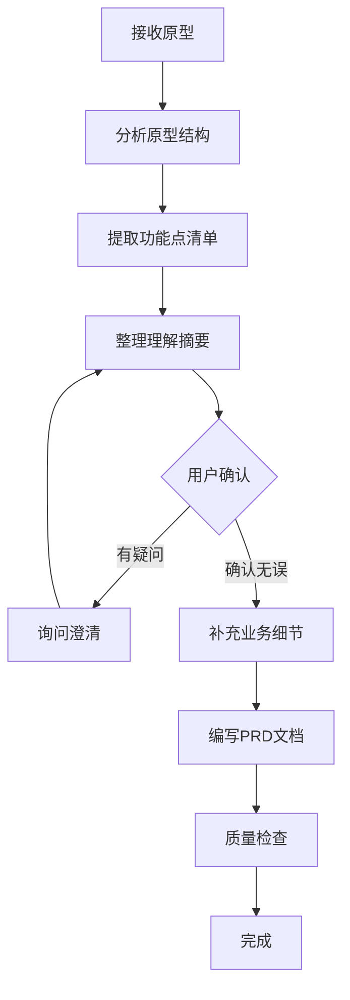

# 原型驱动 PRD 编写场景指南

本文档定义了"原型驱动"PRD编写的标准流程和最佳实践。

---

## 1. 场景定义

### 1.1 什么是原型驱动

**原型驱动**：用户直接提供HTML原型、Figma设计稿、图片、甚至手绘草图，Agent先理解原型中的功能和逻辑，再基于理解编写PRD文档。

### 1.2 适用场景

- 用户已有一份原型设计（HTML/图片/Figma链接）
- 用户希望"先理解原型，再写PRD"
- 强调"边做边问"的对齐模式

### 1.3 不适用场景

- 原型过于简单，仅有UI没有业务逻辑
- 用户明确要求跳过询问直接写
- 原型与业务完全脱节

---

## 2. 核心流程



### Step 1: 接收并读取原型

**支持的原型格式：**
- HTML文件（读取源码分析）
- 图片文件（识别UI元素和布局）
- Figma链接（需用户描述关键信息）
- 手绘稿/白板截图

**读取原则：**
- HTML：读取完整源码，包括CSS和JavaScript
- 图片：描述看到的UI元素、布局、文字内容
- 标注关键信息：字段名、按钮文字、状态值、颜色含义

### Step 2: 分析原型结构

**分析维度：**

| 维度 | 分析内容 |
|------|---------|
| 页面结构 | 有哪些区域（头部、表单、列表、弹窗） |
| 数据字段 | 每个字段的名称、类型、是否必填 |
| 交互元素 | 按钮、下拉、输入框、复选框 |
| 状态定义 | 字段值的状态（如：已收集/缺失、成功/失败） |
| 页面跳转 | 点击链接/按钮后的跳转关系 |
| 数据来源 | 列表数据从哪里来（下拉/API/手工） |

### Step 3: 输出理解摘要

**格式要求：**
- 用表格清晰列出识别到的功能点
- 标注不确定的内容（用"？"标记）
- 提供理解摘要供用户确认

**示例格式：**

```markdown
## 原型理解摘要

### 页面关系
- 页面A → 页面B：点击"XXX"进入
- 页面B → 页面C：点击"XXX"进入

### 功能清单

| 序号 | 功能点 | 说明 | 确认 |
|------|--------|------|------|
| 1 | XX查询 | 按XX条件查询列表 | ✅ |
| 2 | XX新增 | 弹窗新增表单 | ✅ |
| 3 | XX编辑 | 点击行内"编辑"进入 | ❓ |
| 4 | XX删除 | 待确认 | ❓ |

### 不确定项
1. 删除操作是否需要二次确认？
2. 编辑后跳转到哪里？
```

### Step 4: 业务对齐询问

**必须询问的问题：**

1. **业务背景**
   - 这套系统/功能的业务目的是什么？
   - 核心用户是谁？

2. **功能边界**
   - 页面跳转中的"XX跳转"是跳转到哪里？做什么？
   - 按钮操作（保存/提交/删除）的具体行为是什么？

3. **状态逻辑**
   - 某个状态（如"已取消"）的后续处理是什么？
   - 状态变更后是否需要通知相关人？

4. **边界条件**
   - 空数据时显示什么？
   - 操作失败时如何提示？
   - 权限如何控制？

**询问原则：**
- 优先问会改变设计的问题
- 每轮不超过5个问题
- 用开放式问题，不用封闭式

### Step 5: 补充业务细节

基于用户回答，补充：

1. **成功指标** - 功能上线后的衡量标准
2. **异常处理** - 各种边界条件和错误情况
3. **集成关系** - 与其他系统的交互
4. **审计留痕** - 是否需要记录操作日志

### Step 6: 编写PRD文档

按照skill标准模板编写，但需注意：

1. **原型已体现的内容** - 直接引用，标注"见原型"
2. **原型未体现的内容** - 通过询问补充，标注来源
3. **假设与待确认** - 原型中无法确定的内容，列入假设表

---

## 3. 理解框架

### 3.1 页面理解模板

```markdown
## 页面理解：[页面名称]

### 页面基本信息
- **页面标题**：[从title或h1提取]
- **页面路径**：[URL或跳转来源]
- **主要功能**：[一句话描述]

### 布局结构
| 区域 | 位置 | 内容 |
|------|------|------|
| 头部区 | 顶部 | 标题、操作按钮 |
| 内容区 | 中部 | 表单/列表/详情 |
| 底部区 | 底部 | 分页/提交按钮 |

### 数据字段

#### 字段清单
| 序号 | 字段名 | 控件类型 | 必填 | 来源 | 备注 |
|------|--------|----------|------|------|------|
| 1 | | | | | |

#### 按钮清单
| 按钮 | 位置 | 行为 | 确认 |
|------|------|------|------|
| | | | |

### 状态定义
| 状态 | 样式 | 含义 |
|------|------|------|
| | | |

### 页面跳转
| 触发 | 来源 | 目标 | 传参 |
|------|------|------|------|
| | | | |

### 不确定项
1.
2.
```

### 3.2 从原型提取功能点

**提取清单：**

```markdown
## 功能点提取清单

### 查询功能
- [ ] 查询条件：哪些字段可作为查询条件？
- [ ] 查询方式：模糊/精确/范围？
- [ ] 查询结果：展示哪些字段？
- [ ] 排序规则：默认按什么排序？
- [ ] 分页规则：每页多少条？

### 表单功能
- [ ] 必填字段：哪些是必填的？
- [ ] 值列表：哪些字段有下拉选项？
- [ ] 校验规则：有哪些格式/长度/重复校验？
- [ ] 保存逻辑：保存前/保存后做什么？
- [ ] 报错提示：原型中显示了什么报错？

### 列表功能
- [ ] 列表字段：展示哪些列？
- [ ] 行操作：有哪些行内操作按钮？
- [ ] 批量操作：是否支持批量选择和操作？
- [ ] 空状态：无数据时显示什么？
- [ ] 加载状态：加载中如何展示？

### 弹窗功能
- [ ] 触发方式：点击哪个按钮弹出？
- [ ] 弹窗类型：确认/表单/详情？
- [ ] 关闭方式：点击X/取消/确定？

### 状态流转
- [ ] 状态定义：有哪些状态值？
- [ ] 状态样式：不同状态的样式（颜色/图标）？
- [ ] 状态变更：什么操作会导致状态变更？
```

---

## 4. 常见问题处理

### 4.1 原型中有跳转，但目标页面未提供

**处理方式：**
1. 在理解摘要中标注
2. 询问用户："点击XX跳转到哪里？"
3. 在PRD中说明："跳转至[待确认]，本次文档范围[XX页面]"

### 4.2 原型中字段无说明

**处理方式：**
1. 根据字段名推断含义
2. 在理解摘要中列出，推断内容用斜体
3. 询问用户确认："[字段名]是XX意思吗？"

### 4.3 原型中缺少异常处理

**处理方式：**
1. 识别可能出错的地方
2. 询问用户："如果XX失败，如何处理？"
3. 在PRD中补充默认逻辑

### 4.4 原型与业务描述不一致

**处理方式：**
1. 先确认原型是否最新
2. 以原型为准，还是以描述为准？
3. 标注差异，由用户决策

---

## 5. 质量检查

### 5.1 原型理解检查

- [ ] 页面结构分析完整？
- [ ] 所有字段已提取？
- [ ] 按钮行为已理解？
- [ ] 页面跳转关系清晰？
- [ ] 不确定项已标注？

### 5.2 PRD编写检查

- [ ] 原型内容已覆盖？
- [ ] 补充内容已询问确认？
- [ ] 假设项已列入假设表？
- [ ] 验收标准已定义？
- [ ] 接口契约已定义？

### 5.3 询问质量检查

- [ ] 问题具体明确？
- [ ] 一次不超过5个问题？
- [ ] 用开放式问题？
- [ ] 问题有优先级排序？

---

## 6. 实战案例

### 案例：追溯任务详情页

**原始原型：** HTML文件（detail.html）

**理解摘要输出：**

```markdown
## 原型理解摘要

### 页面关系
- `index.html` (总体任务管理) → 点击行"详情" → `detail.html` (当前页面)
- `detail.html` → 点击文件列表"详情" → `file-detail.html`
- `detail.html` → 点击"返回" → `index.html`

### 功能清单

| 序号 | 功能点 | 原型描述 | 确认 |
|------|--------|---------|------|
| 1 | 任务信息展示 | 8个字段：任务号、名称、参数、提交人等 | ✅ |
| 2 | 7步进度展示 | 任务开始→文件收集中→报告待补充→...→报告已归档 | ✅ |
| 3 | 文件列表展示 | 含14列：序号、文件类型、上级、来源、责任人等 | ✅ |
| 4 | 齐套率计算 | 环形进度（整体）+ 进度条（行级） | ✅ |
| 5 | 工具栏按钮 | 数据导出、刷新调度任务、齐套检查等6个按钮 | ❓ |
| 6 | 行操作按钮 | 详情、单独催收、下载 | ✅ |

### 按钮行为（从JS提取）

| 按钮 | 行为 | 来源 | 确认 |
|------|------|------|------|
| 数据导出 | 生成HTML格式Excel并下载 | JS代码 | ✅ |
| 齐套检查 | 跳转 | 原型无目标 | ❓ |
| 一键下载 | alert Demo | JS代码 | ❓ |
| 填报催收 | alert Demo | JS代码 | ❓ |
| 取消任务 | alert Demo | JS代码 | ❓ |

### 不确定项（原型无法确定）

1. **"齐套检查"、"电池生产过程检查报表下载"**：跳转目标URL未提供
2. **催收逻辑**：调用哪个接口？通知谁？
3. **取消任务后**：状态变为"已取消"还是直接删除？
4. **下载逻辑**：单文件直接下载，多文件打包zip？

### 需要向用户询问的问题

1. 业务背景：这套系统是什么场景？追溯链路名称代表什么？
2. 按钮行为：齐套检查跳转到哪里？一键下载的具体行为？
3. 催收逻辑：填报催收调用哪个接口？
4. 状态变更：取消任务后的数据处理？
```

**后续：** 用户回答后，补充业务细节，编写PRD文档。

---

## 7. 总结

**原型驱动的核心原则：**

1. **原型是理解的对象，不是复制的模板**
2. **先理解后设计，边做边问**
3. **原型未体现的，通过询问补充**
4. **保持与用户高频对齐**
5. **不确定的内容必须标注**

**关键成功指标：**
- 用户确认理解正确
- PRD覆盖原型所有可见内容
- 原型未体现的已通过询问补充
- 假设项控制在合理范围（<20%）

---

**相关文件：**
- 主文件 → [SKILL.md](../SKILL.md)
- 检查清单 → [../CHECKLIST_V2.0.md](../CHECKLIST_V2.0.md)
- 模板集合 → [templates.md](templates.md)
